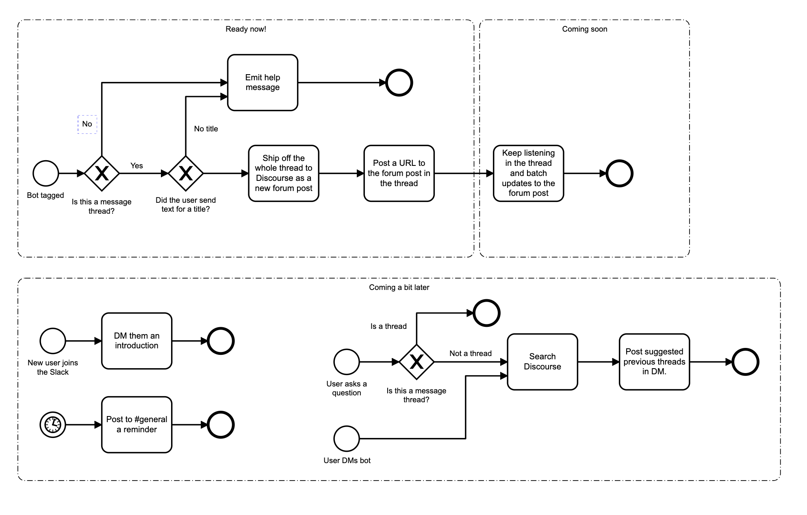

# Slack Archivist

Your friendly Slack-to-Discourse archivist.


This is a Slack bot that can ship threads off to a Discourse instance as forum posts on request.

It was inspired by Dgraph's [Wisemonk](https://github.com/dgraph-io/wisemonk), and built for the [Zeebe.io](https://zeebe.io) community Slack.

One of the issues with hosting a community on Slack is the loss of history. Valuable discussions and answers to questions quickly scroll over the 10,000 message horizon. A number of technical communities have moved to Discord to deal with this.

We looked at doing that, but then saw an opportunity to build a searchable knowledge base on our [forum](https://forum.zeebe.io) by sending valuable threads there as posts. There they can be curated by editors, indexed by Google, and discovered by other members of our community searching for answers.

Dgraph had a similar idea a few years ago, and built Wisemonk in Go. It hasn't been updated for a few years, and I couldn't get it to work - so I coded this up in TypeScript, using Slack's Web API and Events API.

## Prerequisites

Obviously you will need a Slack where you can add bot users, and a Discourse instance where you can get an API key. You will also need to run the bot with a resolvable DNS address, as it needs to listen to Push notifications from Slack's Event API.

## Installation

To install, clone the repository, then run: 

```
npm i
```

## Configuration

Rename `config.json-example` to `config.json`, and fill in your Slack bot and Discord details.

```
{
    slack: {
        "bot_token": "",
        "signing_secret": ""
    },
    "discourse": {
        "token": "",
        "user": "",
        "url": "with a trailing slash",
        "category": 1
    }
}
```

You can also configure Slack Archivist via environment variables:

```
DISCOURSE_TOKEN
DISCOURSE_USER
DISCOURSE_CATEGORY
DISCOURSE_URL
SLACK_BOT_TOKEN
SLACK_SIGNING_SECRET
```

## Running

You can run the bot using `ts-node`: 

```
npm i -g ts-node
ts-node src/index.ts
```

Or by transpiling to JS:

```
npm run build
npm run start
```

## Bot Behaviour

The bot behaviour is described in the [Behaviour.bpmn](Behaviour.bpmn) file.



## Livestream 

I livestreamed a lot of the coding:

* [Building a Slack bot - Slack Archivist for the Zeebe Community: Part 1 of 2](https://youtu.be/v5CkZb-xlBc)

* [Building a Slack bot - Slack Archivist for the Zeebe Community: Part 2 of 2](https://youtu.be/n3zDiqRgW0o)
